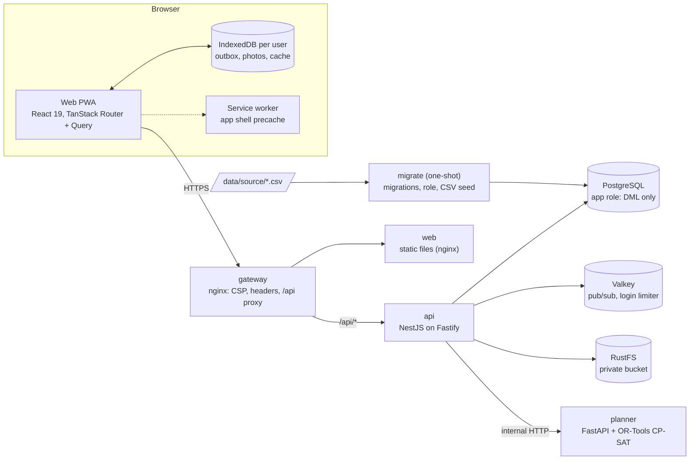
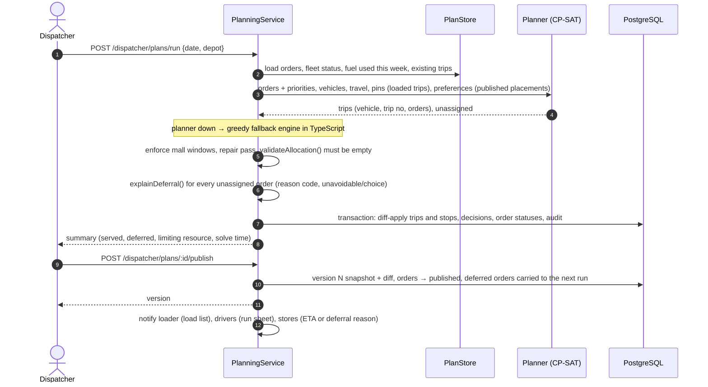
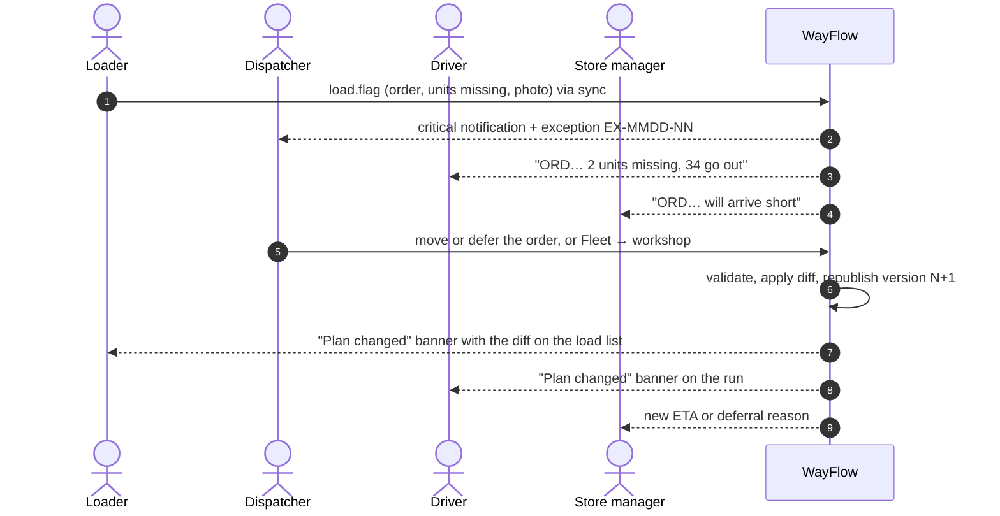
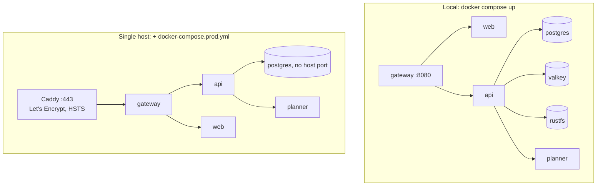

# Architecture: how WayFlow works inside

This document describes the code as built. Diagrams are Mermaid (they render on GitHub).

## 1. Components



The browser only talks to the gateway. The planner has no route through the gateway; only the API calls it.

## 2. Repository map

| Path | Contents |
| --- | --- |
| `packages/shared` | Enums, time helpers, **business rules** (`rules/`: trip-time formula, schedule, `validateAllocation`, cutoff, priority), **state machines**, zod request schemas, response DTO types, status labels. Used by both API and web. |
| `services/planner` | `app/solver.py` CP-SAT model, `app/model.py` request/response contract, pytest suite |
| `apps/api/src` | One Nest module per area (below) |
| `apps/web/src` | `routes/` (file routes per role), `features/` (role components), `components/` (UI primitives and shells), `lib/` (API client, live updates, offline engine) |
| `infra/` | nginx gateway, RustFS provisioning, Caddy for deployments |

### API modules

| Module | Responsibility |
| --- | --- |
| `auth` | Login, refresh rotation, logout, sessions, password change; global guards (`AuthGuard`, `RolesGuard`, `CsrfGuard`) |
| `clock` | Simulation clock and the `/clock` endpoint |
| `reference` | Cached reference data from the CSVs; adjusted travel factor (traffic × road conditions) |
| `planning` | `PlanningService` (run, move, defer, publish, fleet), `PlanStore` (load and diff-persist allocations), `allocation.ts` (pure helpers), `PlannerClient` |
| `dispatcher` | Queue, board, deferrals, live, exceptions, fleet, outlet history, policy, search |
| `store` | Store manager orders and receipts |
| `field` | Loader and driver reads, `SyncService` (offline actions), `SignalWatcher` |
| `attachments` | Upload validation, re-encoding, private storage, authorised reads |
| `notifications` | Per-recipient notifications, SSE stream, Valkey fan-out |
| `exceptions` | The dispatcher's exception queue (`EX-MMDD-NN`) |
| `views` | DTO builders shared by all role endpoints (trip gauges, live ETAs, order status) |
| `audit` | Append-only audit log |
| `seed` | CSV loaders, demo data, reset |
| `dev` | Demo tools: clock and reset (dispatcher, feature-flagged) |

## 3. Life of a request

1. The gateway adds security headers and forwards `/api/*` to the API, appending the client IP to `X-Forwarded-For`.
2. Fastify assigns a request ID, enforces body (1 MB) and time (30 s) limits and logs with credentials redacted.
3. Global guards run in order: **AuthGuard** (deny by default; verifies the access JWT from the httpOnly cookie, reloads the user and checks the session family is not revoked), **throttler** (per user, or per IP before sign-in), **RolesGuard** (`@Roles`), **CsrfGuard** (Origin allow-list and the session-bound `X-CSRF-Token` on every write).
4. The controller validates the body/query with a shared zod schema (`.strict()`: unknown fields are rejected) and calls a service.
5. Services scope every query by the session (outlet, depot or vehicle) inside the `WHERE` clause, run multi-row changes in a transaction, move statuses through the transition tables and write an audit row.
6. Domain services emit notifications; the notifications service stores one row per recipient and publishes to Valkey; each API instance pushes to its open SSE streams. "Invalidate" events tell open screens which TanStack Query keys to refetch.
7. Errors leave through one filter as `{code, message, details, requestId}`, never with stack traces.

## 4. Planning and publishing



After publishing, any valid move, deferral or re-plan **republishes automatically** as version N+1 with a diff, so loaders and drivers are never working from an unannounced change. A second consecutive deferral holds the plan until the dispatcher acknowledges it.

`PlanStore.apply` persists an allocation as a **diff**: trips keep their IDs when their vehicle and trip number survive, stops keep their IDs when the order stays on the same trip, moved orders get a new stop and the old one is marked `skipped`, removed trips are `cancelled`. That is what lets a re-plan happen mid-loading without losing check-offs or delivery records. See [planning-engine.md](planning-engine.md) for the model.

## 5. Offline field work and sync

```mermaid
sequenceDiagram
  autonumber
  actor DR as Driver
  participant UI as PWA
  participant IDB as IndexedDB (wayflow-userId)
  participant API as POST /sync/batch
  participant DB as PostgreSQL
  DR->>UI: Record delivered + photo
  UI->>IDB: outbox += {clientActionId, action, createdAtClient}; photos += blob
  UI-->>DR: stop shows "Delivered · Not synced yet"
  Note over UI: triggers: online event, app start, visibility, every 30 s, after enqueue
  UI->>API: {deviceId, actions[≤100]} in order
  loop each action, own transaction
    API->>DB: already processed (userId, clientActionId)? → duplicate
    API->>API: re-authorise (vehicle/depot scope now), validate, state machine
    API->>DB: apply + ledger row
  end
  API-->>UI: applied | duplicate | conflict | rejected per action
  UI->>API: upload photos of acknowledged actions (POST /attachments)
  UI-->>DR: "All synced" or "N need attention"
```

- The run sheet / load list is fetched network-first and cached in the user's own IndexedDB; offline, the cache is served and queued actions are overlaid optimistically.
- Event times use the client timestamp mapped onto the simulation clock; skew above 12 hours or in the future is flagged.
- A later action for a trip whose earlier action was rejected is rejected as `dependency_failed`.
- **Conflict rule:** a delivery recorded offline for an order the dispatcher moved meanwhile is applied to the order's live stop, flagged `needs_review`, raised as a sync-conflict exception and returned as `conflict`. Field facts are never discarded.
- Logout keeps unsynced items, locked to the user, and offers to send them first.
- `SignalWatcher` raises "Vehicle offline" after 30 silent minutes and tells affected stores updates are delayed; the next sync resolves it.

## 6. Loading shortfall to re-plan



## 7. State machines

Every status change calls `assertTransition` with the transition table for the aggregate; illegal moves fail with `409 illegal_transition` and are unit-tested.

| Aggregate | States | Table |
| --- | --- | --- |
| Order | draft → confirmed → planned → published → loaded → departed → delivered/partial/failed → received/disputed; deferred; cancelled | `ORDER_TRANSITIONS` |
| Plan | generated → edited → published → replanned → published → closed | `PLAN_TRANSITIONS` |
| Trip | planned → loading → ready → departed → completed; cancelled | `TRIP_TRANSITIONS` |
| Stop | pending → arrived → delivered/partial/failed; skipped | `STOP_TRANSITIONS` |

## 8. Time

All business times are Asia/Colombo. Times of day are stored as minutes since midnight; instants as `timestamptz`. The **simulation clock** (`app_settings.simulation_clock`) stores an anchor (simulated instant, real instant) and advances in real time; the cutoff, run dates, field event times, exceptions and notifications use it. Real time is used only for security (token expiry, audit, rate limits).

## 9. Live ETAs

Planning feasibility uses the booklet's free-flow Task 2B formula. Planned arrivals and live ETAs use the adjusted model: `freeflow × 100/speed_index(district, hour, monsoon) × 100/disruption_index(district, date)`, with indices clamped to [20, 100], waiting for the window to open and adding any delay the driver reported. Once a trip departs, ETAs restart from the last recorded stop.

## 10. Deployment views



The AWS options (EC2 fast path, ECS Fargate later) are in [deployment.md](deployment.md).
