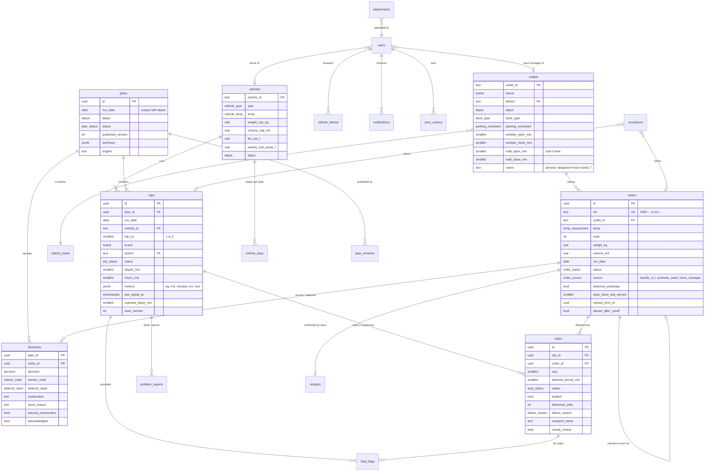

# Data model

Source of truth: [`apps/api/src/db/schema.ts`](../apps/api/src/db/schema.ts) (Drizzle). Migrations are generated into `apps/api/drizzle/` and committed. 26 tables in three groups: reference data loaded 1:1 from the CSVs, people and security, and the operational day.

## Entity relationships

Not drawn: `calendar_days`, `service_allowances`, `traffic_speeds`, `road_conditions`, `unit_profiles`, `audit_log`, `app_settings`.

## Tables

### Reference data (loaded from `data/source`, read-only for the app role)

| Table | Rows | Natural key | Notes |
| --- | ---: | --- | --- |
| `outlets` | 120 | `outlet_id` | Windows as minutes since midnight; `name` derived from brand, district and position (the CSV has no store names) |
| `vehicles` | 60 | `vehicle_id` | |
| `calendar_days` | 910 | `date` | Operating day, payday, festival + ramp, monsoon |
| `district_travel` | 12 | `district` | Free-flow minutes and km depot→district and between stops |
| `service_allowances` | 9 | `brand, dock_type` | Handling minutes; never hard-coded |
| `traffic_speeds` | 576 | `district, hour, monsoon` | Speed index for ETAs |
| `road_conditions` | 10,920 | `district, date` | Disruption index for ETAs |
| `unit_profiles` | 4 | `brand, temp` | Average kg and m³ per unit from `deliveries_train.csv`, for the store order estimate |

The seed asserts each row count and fails on any unexpected header, number, enum value or time format.

### People and security

| Table | Purpose |
| --- | --- |
| `users` | Email (unique), role, Argon2id hash, scope (`depot`, `outlet_id` or `vehicle_id`, enforced by a check constraint per role), `sessions_valid_after` |
| `refresh_tokens` | Keyed SHA-256 of each refresh token, `family_id` (= session id), idle and absolute expiry, `used_at`, `replaced_by`, `revoked_at` |
| `audit_log` | Append-only (the app role has no UPDATE/DELETE): actor, role, action, entity, details, truncated IP, request id |

### The operational day

| Table | Purpose |
| --- | --- |
| `orders` | One row per order (a Fresh outlet can have a chilled and an ambient order the same day). Status follows the order state machine |
| `plans` | One per run date and depot; working status, published version, summary (served, deferred, limiting resource, engine) |
| `plan_versions` | Snapshot `{tripKey: [orderRefs]}` and diff for every published version (drives the "Plan changed" banners) |
| `vehicle_days` | `available` / `in_workshop` per vehicle and date |
| `trips` | Vehicle, trip 1 or 2, brand, district, status, planned depart/return, metrics snapshot, last signal, reported delay |
| `stops` | One per order on a trip, in sequence: planned arrival, loaded flag, outcome, recipient, location, review flag |
| `decisions` | Served or deferred per order and plan, reason code, unavoidable/choice, explanation, store-facing reason, second-deferral acknowledgement |
| `load_flags` | Loader shortfall or damage (id = the client action id, so photos can be linked offline) |
| `problem_reports` | Driver problems with optional delay |
| `receipts` | Store confirmation or dispute per order |
| `exceptions` | Dispatcher exception queue, code `EX-MMDD-NN` |
| `attachments` | Photo metadata: server-generated object key, type, size, owner, entity link; unique per (uploader, client attachment id) |
| `notifications` | One row per recipient, read state |
| `sync_actions` | Idempotency ledger, unique per (user, client action id), client time and skew flag |
| `app_settings` | Simulation clock anchor |

## Invariants in the database

| Invariant | Mechanism |
| --- | --- |
| ≤ 2 trips per vehicle per day | `check trip_no in (1, 2)` + unique `(run_date, vehicle_id, trip_no)` for non-cancelled trips |
| An order is on at most one live stop | Unique `order_id` for stops not `skipped` |
| A deferred decision has a reason | `check decision = 'served' or reason_code is not null` |
| Positive sizes and capacities | `check` on orders and vehicles |
| One plan per run date and depot | Unique `(run_date, depot)` |
| Role scope present | `check` on users (store manager → outlet, loader → depot, driver → vehicle) |
| Offline action applied once | Unique `(user_id, client_action_id)` |

## Indexes

Orders by `(run_date, status)` and `(outlet_id, run_date)`; trips by plan and by `(run_date, vehicle_id)`; stops by `(trip_id, seq)`; notifications by `(user_id, created_at)` plus a partial index on unread; exceptions by run date; audit by entity and time; attachments by entity.

## Roles

| Role | Used by | Rights |
| --- | --- | --- |
| Owner (`POSTGRES_USER`) | `migrate` job only | DDL, seeding |
| `wayflow_app` | API at runtime | SELECT/INSERT/UPDATE/DELETE on operational tables; SELECT on reference tables; INSERT/SELECT only on `audit_log`; no CREATE |
