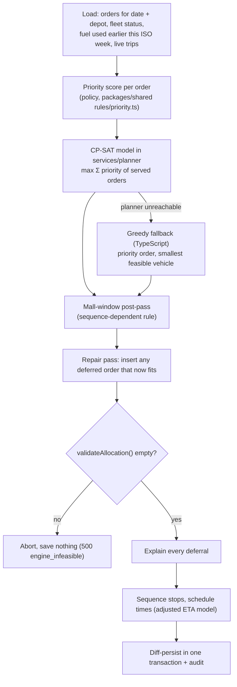

# Planning and allocation engine

Goal (specs/07): every confirmed order for a depot and run date is either **served** on a vehicle and trip that satisfies every operating rule, or **deferred** with a reason, and the result is explainable. It is judged on feasibility and reasoning, not on a single "correct" answer.

## Pipeline

## The CP-SAT model (`services/planner/app/solver.py`)

| Variable | Meaning |
| --- | --- |
| `z[v,t,b]` | Vehicle `v` runs trip `t ∈ {1,2}` for bucket `b = (brand, district)`; at most one bucket per trip (rule 1) |
| `x[o,v,t]` | Order `o` rides trip `t` of vehicle `v`; created only when compatible: chilled → reefer, van-only → van (rules 2, 3); vehicles are pre-filtered to the depot and to `available` (rule 4, workshop) |

| Constraint | Booklet rule |
| --- | --- |
| `Σ x[o,·,·] ≤ 1` | 5: whole orders, never split |
| `x[o,v,t] ⇒ z[v,t,bucket(o)]`, empty trips forbidden | 1: one brand and district per trip |
| `Σ kg ≤ cap_kg`, `Σ m³ ≤ cap_m³` per trip | 6: both limits |
| `Σ_t (Σ_b z·(out − inter) + Σ_o x·(inter + service)) ≤ 270` for Fresh buckets, `≤ 480` for Style + Tech | 7: Task 2B formula `outbound + inter × (n − 1) + Σ handling`, separate budgets |
| `t ∈ {1,2}`, trip 2 only after trip 1, a Fresh trip 2 needs a Fresh trip 1 | 7: at most two trips |
| `Σ km (with return leg) ≤ remaining weekly fuel × km/L` | fuel quota |
| pinned `x = 1` | orders already loaded or on the road stay put during a re-plan |

Objective: `10 × Σ priority(o)·x − Σ trip cost` (trip cost = 50 + vehicle m³, so smaller vehicles and fewer trips win ties) `+ 40` for keeping a published placement (stable re-plans). Scaled to integers (0.1 kg, 0.01 m³, 0.1 min, 0.1 km).

Determinism: one model, fixed seed, `interleave_search` with 8 workers and a **deterministic time limit** (4 units), so the same input gives the same plan. On the S1 day (85 orders, 28 vehicles) a run takes about 2–3 s end to end.

### Priority policy (`rules/priority.ts`, specs/03 §9)

1. Outlets deferred on the last run (+10,000) and outlets not served for several days (+300 per day, up to 14).
2. Fresh chilled (+3,000), then Fresh ambient (+2,000).
3. Tech (+1,200), then Style (+1,000).
4. Earlier window close breaks ties.

Because the objective is the sum of priorities, the solver can serve two smaller lower-priority orders instead of one large higher-priority order when that packs better; the explanation says so.

## Rules the planner does not model

**Mall windows** depend on stop order. After solving, stops are sequenced (earliest window close, rear dock before street, outlet id; orders for one outlet stay together) and scheduled; if a mall outlet would be served after its mall window closes, the lowest-priority order on that trip is removed and deferred as `WINDOW_INFEASIBLE`.

**Late arrivals** at ordinary outlets are allowed (specs/03 §2.5) and flagged as late risk.

## Validation: one rulebook for engine and dispatcher

`validateAllocation(trips, context)` in `packages/shared/src/rules/validate.ts` checks rules 1–7 plus fuel, operating day, workshop vehicles and mall windows, and returns machine-readable violations. It runs:

- on the engine output (must be empty, or nothing is saved),
- on every dispatcher move (dry run or real); a violation blocks the move and the response carries the rule and a sentence such as *"Adding 410 kg and 2.8 m³ would make the load 1,380 of 1,040 kg and 9.6 of 7.0 m³. Both limits are broken."*

## Explaining deferrals (`apps/api/src/planning/allocation.ts`)

For each deferred order:

1. No compatible vehicle exists at all → `NO_REEFER_CAPACITY` / `NO_VAN_CAPACITY`, **unavoidable**.
2. Compatible vehicles exist but all are in the workshop → `VEHICLE_UNAVAILABLE`, **unavoidable**, naming them.
3. It does not fit any compatible vehicle even on an empty trip (too big, too far for the budget, fuel exhausted) → the failing rule, **unavoidable**.
4. Otherwise it would fit if capacity had not gone to other orders → **choice**. Every insertion option on every compatible vehicle is re-tested; the most common binding rule becomes the reason (for chilled or van-only orders, the scarce-fleet reason `NO_REEFER_CAPACITY` / `NO_VAN_CAPACITY`). The explanation counts any lower-priority orders served on those vehicles and lists vehicles in the workshop.

The summary reports served and deferred counts by brand, the unavoidable/choice split and the **limiting resource** (the reason with the most deferrals). The policy page turns this into a printable one-page write-up with the consequence for each store.

A deferral on the previous run sets `deferred_yesterday`; deferring that outlet again is a **second consecutive deferral**: it raises a critical exception and blocks publishing until acknowledged.

## Re-planning

`run` on a published plan keeps orders on trips that are loading, loaded or on the road (pins), prefers existing placements for the rest, re-validates, applies the result as a diff and republishes version N+1. Triggers: the dispatcher's **Re-plan**, a vehicle sent to the workshop from **Fleet**, or manual moves after a shortfall.

## Degraded mode

If the planner is down or times out, `greedyAllocate` (priority order, best fit on the smallest compatible vehicle, every insertion validated) produces a feasible plan; the plan board says "Planner offline: fallback engine used".

## Tests

| Suite | What it proves |
| --- | --- |
| `packages/shared/test/rules.test.ts` | Each rule pass/fail; booklet examples 101 min (Gampaha), 112 min (Colombo), 213 of 270 and third trip rejected; separate Fresh / Style budgets; fuel; workshop; operating day; mall window |
| `services/planner/tests/test_solver.py` | Rules hold on generated instances; chilled/van-only matching; Fresh budget; priority wins scarce capacity; determinism |
| `apps/api/test/unit/allocation.test.ts` | Fallback engine has zero violations and is deterministic; mall post-pass; repair; every explanation branch |
| `apps/api/test/integration/api.test.ts` | On the real S1 day: < 5 s, every order accounted for once, every deferral has a reason and class; blocked move leaves the plan unchanged |
